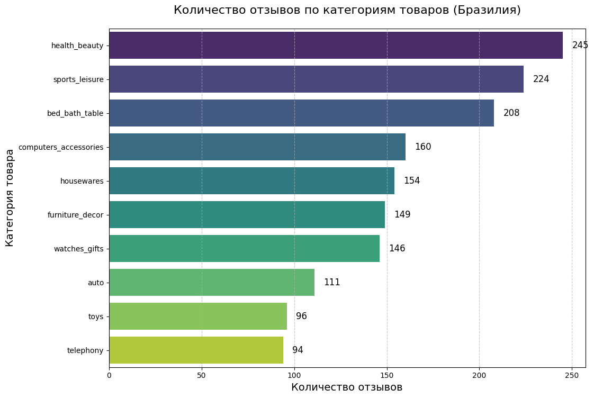
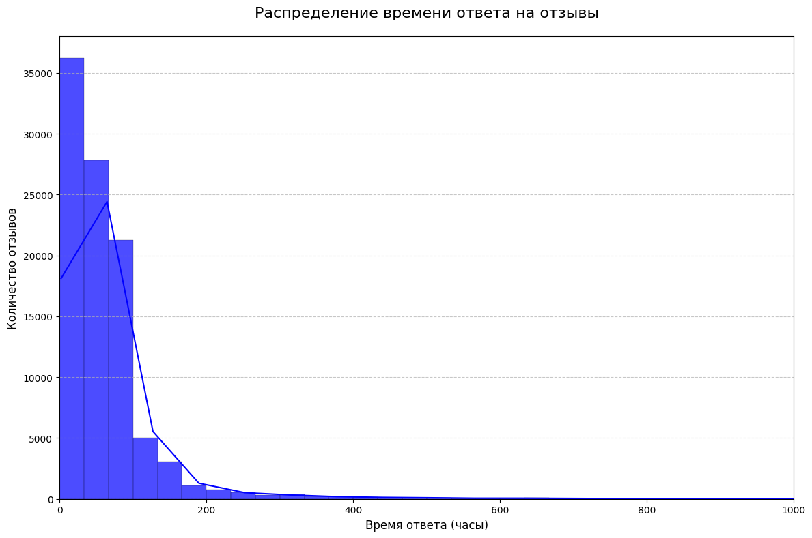
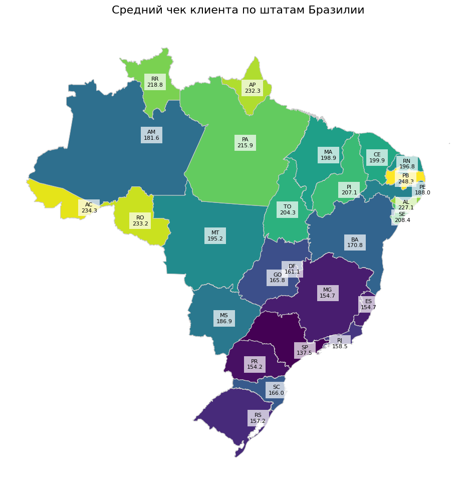
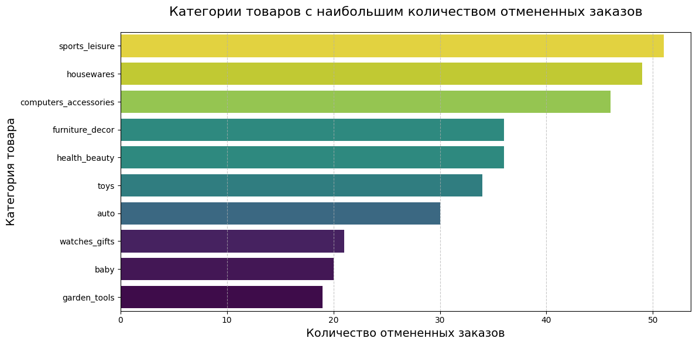

# Бонусное задание по базам данных

---
## 🪪 Вариант 3

Имя: *Danil (4)*  
Фамилия: *Kadyrov (11)*  
TG: *dankadyrov (1)*  

Вариант = (11 + 4 + 1) mod 7 + 1 = 3  

---

## 🎯 Условие

Предложены данные компании Olist, которые содержат информацию о 100 тысячах заказов с 2016 по 2018 годы.

Схема таблиц с [официального описания](https://www.kaggle.com/datasets/olistbr/brazilian-ecommerce) выглядит следующим образом:


#### Задание:

1. Определите, на какие категории товаров в штате Бразилиа пользователи чаще всего оставляют комментарии и подумайте, почему они это делают.
2. Исследуйте скорость заполнения пользователями формы о качестве заказа.
3. Рассчитайте средний чек клиента для каждого штата.
4. Найдите категории товаров, которые чаще всего попадают в отмененные заказы.

---

## 🛠️ Техническая часть

### 🗂 Структура проекта

```
.
├── README.md
├── analysis
│   └── analysis.ipynb               # Jupyter Notebook с анализом данных
├── csv_tables                       # Данные Olist
│   ├── olist_customers_dataset.csv
│   ├── olist_geolocation_dataset.csv
│   ├── olist_order_items_dataset.csv
│   ├── olist_order_payments_dataset.csv
│   ├── olist_order_reviews_dataset.csv
│   ├── olist_orders_dataset.csv
│   ├── olist_products_dataset.csv
│   ├── olist_sellers_dataset.csv
│   └── product_category_name_translation.csv
├── data
│   └── brazil-states.geojson        # GeoJSON файл с границами штатов Бразилии
├── docs
│   └── model.png                    # ER-диаграмма базы данных
├── images
│   ├── avg_check_map.png
│   ├── cancellation_count.png
│   ├── review_count.png
│   └── review_speed.png
├── requirements.txt
├── results                          # Результаты выполнения SQL-запросов
│   ├── 03_task1_results.txt         # Результаты по задаче 1
│   ├── 04_task2_results.txt         # Результаты по задаче 2
│   ├── 05_task3_results.txt         # Результаты по задаче 3
│   └── 06_task4_results.txt         # Результаты по задаче 4
├── run.sh                           # Bash-скрипт для исполнения SQL запросов
└── scripts                          # SQL-скрипты
    ├── 01_create_tables.sql         # Создание структуры базы данных
    ├── 02_import_data.sql           # Импорт данных из CSV в таблицы
    ├── 03_task1.sql                 # Запросы для задачи 1
    ├── 04_task2.sql                 # Запросы для задачи 2
    ├── 05_task3.sql                 # Запросы для задачи 3
    └── 06_task4.sql                 # Запросы для задачи 4
```

---

### 🚀 Инструкция по запуску

Для запуска SQL-скриптов из директории `scripts/` достаточно выполнить следующие команды, предварительно убедившись, что `PostgreSQL` установлен:

```bash
chmod +x run.sh
./run.sh
```

Результаты SQL-запросов сохранятся в директорию `results/`.

---

### 👣 Ход работы

Для начала требуется создать базу данных `olist`, после чего создать таблицы в соответствии с данными и описанием. DDL-скрипты представлены в `scripts/01_create_tables.sql`.

Далее нужно перенести данные из представленных CSV-файлов в SQL-таблицы. Для этого используется оператор `COPY`. По ходу переноса данных возникла проблема с дублированием значений в поле, являющемся первичным ключом. Для решения этой проблемы была создана временная таблица, которая не имела первичного ключа. В нее занесли все данные, при коммите она удалялась, а данные переносились в основную таблицу с помощью `INSERT` с опцией `ON CONFLICT DO NOTHING`. Этим действиям соответствует `scripts/02_import_data.sql`.

---

### 🧑‍💻 Анализ

Анализ был проведен в Jupyter Notebook. Для воспроизведения результатов необходимо установить зависимости из `requirements.txt` в виртуальное окружение `venv`. Внутри ноутбука изложены более подробные результаты, и рассмотрено больше информации из предоставленных данных.

Для выполнения SQL-запросов была использована библиотека `psycopg2`. Была реализована функция чтения файла с SQL-скриптом, его выполнения и записи результатов в список `pd.DataFrame`.

---

## ✍️ Выводы

В ходе работы были проанализированы категории товаров, на которые чаще всего пишут отзывы, скорость заполнения пользователями формы о качестве товара, средний чек клиентов по штатам Бразилии, а также категории товаров, которые чаще всего попадают в отмененные заказы.

**1. Категории товаров с наибольшим количеством отзывов:**  
Оказалось, что чаще всего пользователи оставляют отзывы на такие категории товаров, как *красота и здоровье*, *спортивная экипировка* и *постельное белье/текстиль*. Эти категории значительно опережают другие по количеству отзывов. Это может быть связано с тем, что такие товары сложно оценить только по картинке или описанию — их качество становится очевидным только после использования. Пользователям важно проверить функциональность, удобство и долговечность таких товаров непосредственно в быту.



**2. Скорость заполнения формы о качестве товара:**  
Анализ показал, что пользователи чаще всего заполняют форму в течение первых 200 часов после ее создания. После этого срока количество отзывов резко снижается. Это может объясняться тем, что пользователи либо забывают о форме, либо товар их полностью устраивает, и они не видят необходимости оставлять отзыв. Интересным примером является отзыв с самым длительным временем заполнения (порядка 518 дней). Этот отзыв имеет низкую оценку (1 балл), что может свидетельствовать о том, что пользователь вспомнил о форме только из-за возникших проблем с товаром (например, его выхода из строя).



**3. Средний чек клиентов по штатам Бразилии:**  
Сравнение средних чеков по штатам выявило следующие закономерности:
- На юге Бразилии средний чек ниже, чем в остальных частях страны.
- Самые высокие средние чеки наблюдаются в штатах, расположенных на границах страны.
- Максимальный средний чек зафиксирован в штате *Параиба (PB)*, расположенном на востоке страны (самый восточный штат), и составляет **248,3**.
- Минимальный средний чек наблюдается в штате *Сан-Паулу (SP)* и составляет **137,5**.

Эти различия могут быть связаны с региональными особенностями покупательской способности, культурными предпочтениями или уровнем экономического развития каждого штата.



**4. Категории товаров, которые чаще всего попадают в отмененные заказы:**  
К категориям товаров, которые чаще всего попадают в отмененные заказы, относятся *спортивная экипировка*, *предметы домашнего обихода* и *компьютерные аксессуары*. Возможные причины:
- **Спортивная экипировка:** Часто отменяется из-за несоответствия размера, неудобства или наличия брака.
- **Предметы домашнего обихода:** Отмены могут быть связаны с повреждениями при транспортировке (например, разбитые зеркала) или несоответствием ожиданиям.
- **Компьютерные аксессуары:** Электроника может часто оказываться неисправной или не соответствовать заявленным характеристикам.



Вероятно, последние две категории чаще других подвержены браку и поломкам, связанным в том числе и с логистикой.

---

## 📚 Справочные материалы

- [Описание Olist](https://www.kaggle.com/datasets/olistbr/brazilian-ecommerce)
- [Коды штатов Бразилии (ISO 3166-2:BR)](https://en.wikipedia.org/wiki/ISO_3166-2:BR)
- [Федеральный округ Бразилиа](https://en.wikipedia.org/wiki/Federal_District_(Brazil))

---

## TL;DR

- Проанализированы данные компании Olist за 2016–2018 годы.
- Выявлены категории товаров с наибольшим количеством отзывов (*красота и здоровье*, *спортивная экипировка*, *постельное белье/текстиль*).
- Пользователи чаще всего заполняют форму о качестве товара в течение первых 200 часов.
- Средний чек выше в штатах на границах страны, максимальный — в Параибе (**248,3**), минимальный — в Сан-Паулу (**137,5**).
- Наиболее часто отменяемые категории: *спортивная экипировка*, *предметы домашнего обихода*, *компьютерные аксессуары*.
- Анализ выполнен в PostgreSQL и Python, результаты доступны в виде графиков и таблиц.
